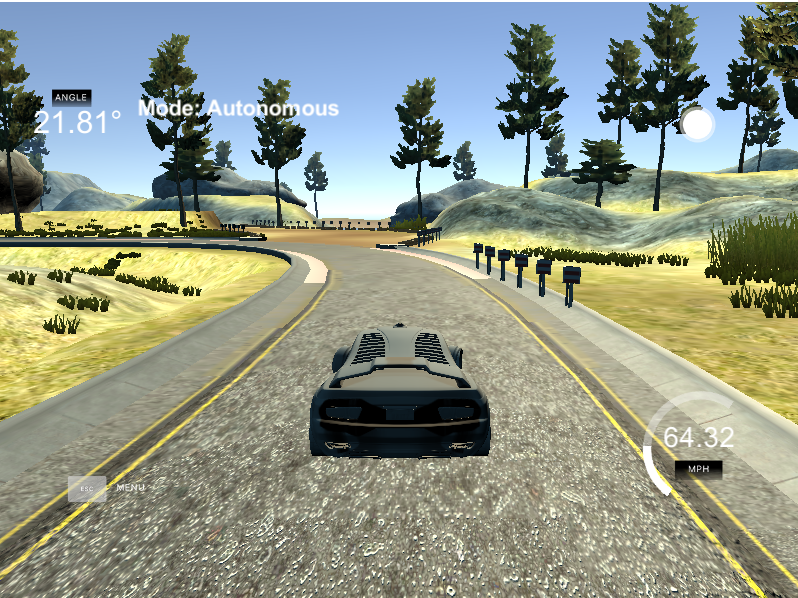

# PID Control

In this project, I implemented a PID control to steer a car on a track in a simulator. In particular, I had to tune the corresponding parameters such that the car would not depart from the correct path.

My submission includes the following files:

- __main.cpp__: Here, the initialization of the PID controller is called as well as the Update step that returns the steering command.
- __pid.cpp__: In this file, most of the programming takes place including the initialization of the filter, the UpdateError routine and the Twiddle algorithm for hyperparameter tuning. The function TotalError computes the steering command.
- __pid.h__: The corresponding header file.

## Implementation

I implemented the PID control as was presented in the lecture by Sebastian Thrun. The steering command is given by the function TotalError. This procedure is called by the function UpdateError that receives the current CTE (Cross Track Error).

## Reflection

In order for the PID controller to work, it is very crucial to choose the right parameters. First, I wanted to start by setting the initial parameters all to zero and just using the twiddle algorithm to tune them. As it turned out, this did not work very well.

Therefore, I started experimenting more manually until I found the starting values [0.1, 0.01, 10] which worked quite well already. Then, I used the twiddle algorithm (with dp = [0.01, 0.001, 1]) to do some fine-tuning and ended with the values [0.082, 0.012, 9.331]. However, instead of the total sum of the CTE, I used a decaying sum for the integral part. With this setting, the car is able to drive safely through the track.

For the manuel tuning, I started by experimenting with the Kp parameter value first, then with the Kd parameter. Here, I found it helpful to have quite a large value in comparison in order to be able to do sharp turns. After that the car drove quite well and choosing the Ki value was only necessary to smoothen the result. Therefore, for my results the parameters Kp and Kd were more important than the Ki value. Actually, I expected this behavior since the integral part comes into play if there is a systematic bias.

I analysed the effects of the individual components by checking the driving behavior of the car with different controllers as follows:

| Type of controller    | Driving behavior    |
| :--- | :--- |
| PID | Completes track. Very good and smooth. |
| P | Does not complete track. The car starts smoothly but keeps oscillating more and more around the ground truth until it crashes. |
| D | The car does not seem to find the ground truth and keeps deviating slowly but steadily from the road until it crashes.  |
| I | Similar to the P controller but crashes more quickly. |
| PD | Completes track but one time slightly touches lane marking. Sharp turns due to derivative part. Also less smooth compared to the PID controller. |
|PI | Car starts oscillating quickly and crashes. |
| ID | Completes track without error. Less smooth compared to the PID controller. |

It can be summarized that either the P-component or the I-component is needed for the car to know where the ground truth lane is. The D-component reduces the oscillation and helps with sharp turns. PD, ID, and PID successfully completed the track, however, the PID controller obtains the best driving behavior.

In the main.cpp file, I also implemented a speed up (to use it, you just have to uncomment it). If the CTE is low, the car is going to speed up in two phases (with speeds 0.5 and 1.0). With this setting, the car is still able to manage the track. It is much faster but also less smooth. I got the following results:

| Throttle    | Speed Up 1: cte < x   | Speed Up 2: cte  < x  | Average Speed    |  Car Completes Track    |
| --- | --- | --- | --- | ---|
| 0.3 | - | - | 30 | yes |
| 0.3 | 0.3 | 0.2 | 50 | yes |
| 0.3 | 0.4 | 0.3 | 54 | yes |
| 0.3 | 0.5 | 0.4 | 57 | yes |
| 1.0 | - | - | 64 | sort of\* |

\* with full speed the car departs from the path but completes one full round. However, it crashes immediately afterwards...

## Simulation and Video

The car drives safely thorugh the track. I included a [video](./video.mp4 "Project Video") in the repository. Note that I had to do the recording with my phone since using the simulator and a screen recorder simultaneously turned out be too demanding for my computer.

## Discussion

I found that the manual tuning was more important than the twiddle algorithm which I only used for fine-tuning. It would be interesting to apply reinforcement learning in order to obtain an optimal driving behavior.
